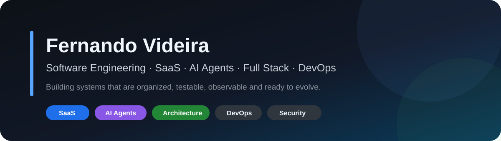
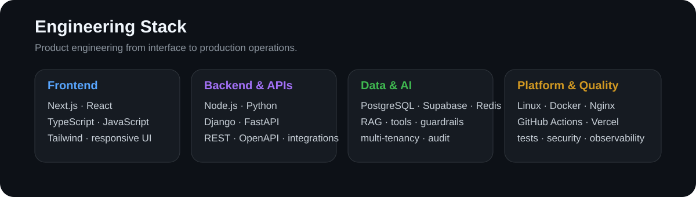

<p align="center"></p>

# Fernando Videira

**Software Engineering · SaaS · AI Agents · Full Stack · DevOps**

Construo e evoluo produtos digitais conectando **produto, arquitetura, código, dados, infraestrutura e operação**.

```text
REQUIREMENTS → ARCHITECTURE → BUILD → TEST → REVIEW → SHIP → OBSERVE → IMPROVE
```

## Engenharia

Foco atual:

- SaaS multi-tenant;
- AI Agents, RAG, tools, guardrails e automação;
- CRM, agenda e atendimento omnichannel;
- WhatsApp / Instagram e integrações;
- APIs e sistemas orientados a eventos;
- Next.js / React / TypeScript;
- Node.js e Python;
- PostgreSQL / Supabase / Redis;
- Linux / Docker / Nginx / CI/CD;
- UML / BPMN / C4 / ADR / OpenAPI / AsyncAPI;
- testes, segurança e observabilidade.

## Stack

<p align="center"></p>

> **Python backend está em evolução contínua**, com Django/DRF e FastAPI aplicados a APIs, autenticação, services, testes e OpenAPI.

## O que eu construo

| Área | Aplicação |
|---|---|
| **SaaS** | multi-tenancy, onboarding, permissões, catálogo, billing e auditoria |
| **AI Agents** | RAG, tools, guardrails, memória, handoff, avaliação e observabilidade |
| **CRM & Messaging** | agenda, leads, WhatsApp, Instagram, inbox e automações |
| **Backend** | APIs, autenticação, autorização, dados e integrações |
| **Architecture** | requisitos, UML, C4, BPMN, ADRs e contratos |
| **DevOps** | VPS, Docker, Nginx, CI/CD, backup, rollback e monitoramento |

## Projetos em destaque

<table>
<tr>
<td width="50%" valign="top">
<a href="https://github.com/Videirafo/SaaS-Engineering-Playbook"></a>
<br/><strong>SaaS Engineering Playbook</strong><br/>
Manual de engenharia para multi-tenancy, segurança, APIs, testes, observabilidade e produção.
</td>
<td width="50%" valign="top">
<a href="https://github.com/Videirafo/AI-Agent-Production-Checklist"></a>
<br/><strong>AI Agent Production Checklist</strong><br/>
Checklist de produção para guardrails, tools, RAG, evals, tracing, approvals e incident response.
</td>
</tr>
<tr>
<td width="50%" valign="top">
<a href="https://github.com/Videirafo/System-Modeling-Starter"></a>
<br/><strong>System Modeling Starter</strong><br/>
Starter para requirements, UML, BPMN, C4, ERD, ADR, OpenAPI, AsyncAPI e rastreabilidade.
</td>
<td width="50%" valign="top">
<a href="https://github.com/Videirafo/Fernando_Videira"></a>
<br/><strong>Engineering Portfolio & Knowledge Base</strong><br/>
Skills, arquitetura, modelagem, AI Engineering, backend, frontend, produção e GitHub Growth.
</td>
</tr>
</table>

## Knowledge Base

Desenvolvo e mantenho sistemas reutilizáveis de engenharia:

- **VIDEIRA OMEGA STUDIO OS** — sistema operacional mestre de projetos;
- **SYSTEM-MODELING-2026** — requisitos, UML, BPMN, C4, ERD e ADR;
- **PY-BACKEND-2026** — Django, FastAPI, APIs, segurança e testes;
- **GITHUB-PRO-2026** — GitHub Flow, portfólio e qualidade de repositório;
- **AI Agent Engineering** — agentes, RAG, GraphRAG, MCP/A2A e guardrails;
- **Execution & Project Memory** — Project Studio, COHI, PM26 e memória de projeto;
- **Frontend Product Experience** — UI/UX, mobile, acessibilidade e performance;
- **VPS & Production Engineering** — deploy, backup, rollback e observabilidade;
- **Game Studio Mobile** — arquitetura, gameplay, save, economia e publicação.

### [Abrir a base completa de conhecimento →](https://github.com/Videirafo/Fernando_Videira/tree/main/skills)

## Princípios de execução

```text
Inspect before changing
Small reversible changes
Issue → Branch → Pull Request
Code and documentation evolve together
Security by design
Tests for critical behavior
Observability before incidents
Backup and rollback before risky changes
```

## Open Source & evolução

Objetivos públicos:

- criar projetos úteis que outras pessoas consigam executar e reutilizar;
- contribuir com documentação, testes e correções em projetos open source;
- manter CI e segurança visíveis;
- evoluir achievements como consequência de colaboração real, sem farming artificial.

## Segurança e privacidade

Os repositórios públicos não devem conter senhas, tokens, `.env` reais, chaves privadas, IPs internos sensíveis, dados de clientes, conversas privadas ou código proprietário de projetos privados.

---

<div align="center">

**Build · Test · Ship · Observe · Improve**

`Software Engineering` · `SaaS` · `AI Agents` · `Architecture` · `DevOps`

</div>
